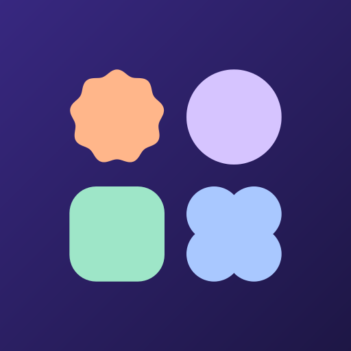
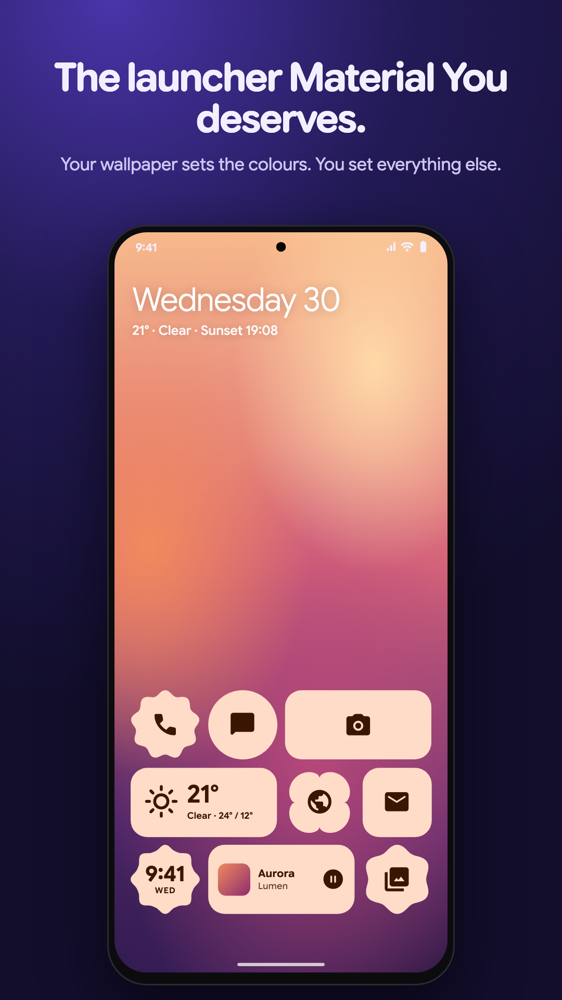
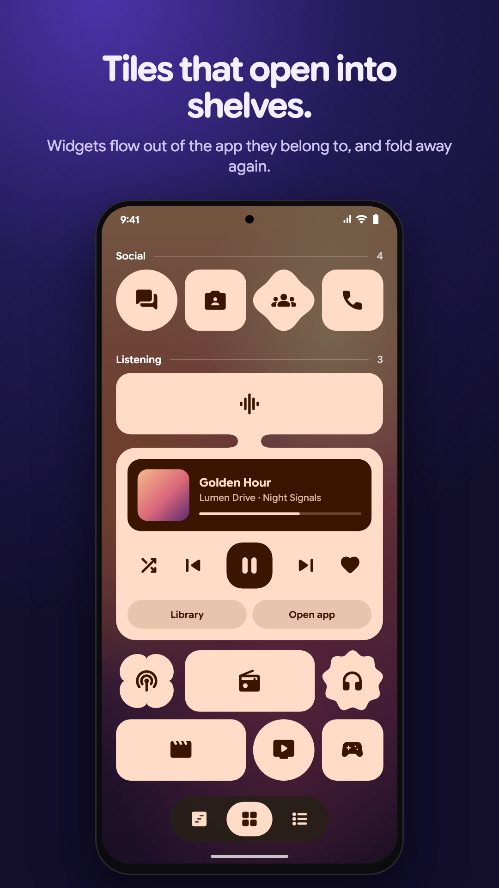
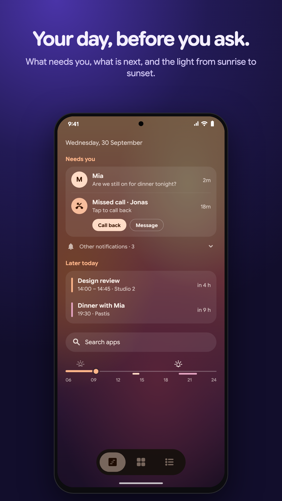
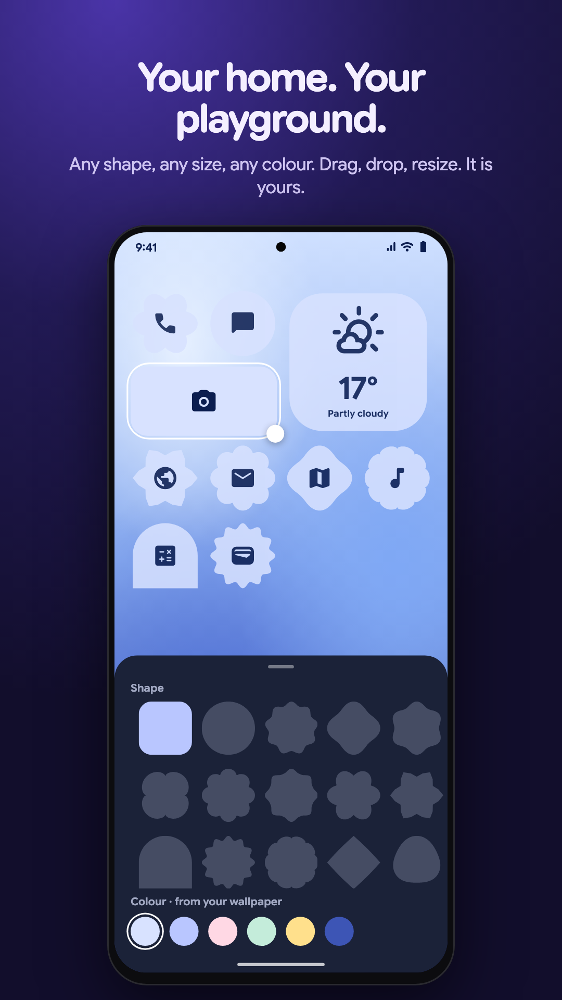
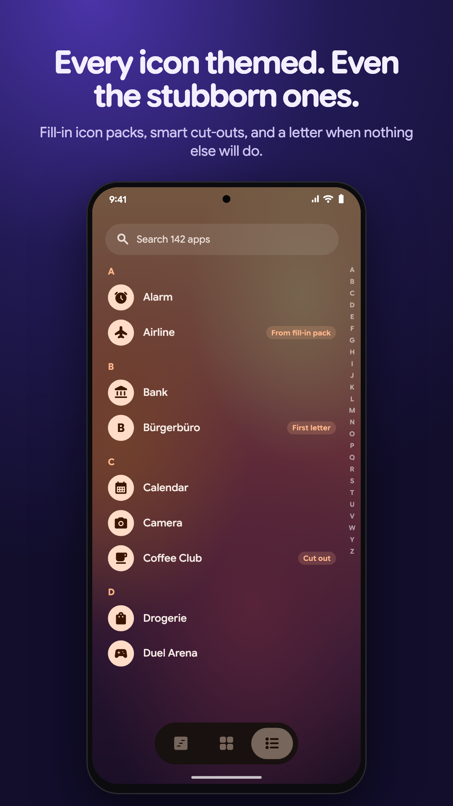

  

<h1 align="center">Merit Launcher</h1>

  A home screen for Android 12+, built on Material 3 Expressive: shaped tiles that open into widget shelves, a page for your day, and themed icons for every app.

  <a href="https://play.google.com/store/apps/details?id=com.merit.launcher">Google Play</a> ·
  <a href="https://github.com/lmbsapps/merit-launcher/issues">Issues</a> ·
  <a href="https://lmbsapps.eu/merit/privacy">Privacy</a>

  
  
  
  
  

> [!NOTE]
> Merit is in closed testing on Google Play. This repository is the public face of the
> project: screenshots, notes on how it works, and the issue tracker. The source is not
> published.

## Why

Material You gave Android a colour system, a set of shapes and, with Material 3
Expressive, a motion language. Very little of that reached the home screen. Most
launchers, including the ones phones ship with, are still a grid of icons on a
wallpaper with the new colours applied on top.

Merit started as the question of what a launcher would look like if it were designed
from those parts instead of decorated with them. The answer it settled on:

- The tile is the unit, not the icon. Tiles take any of Material's shapes (cookie,
  clover, gem, pill, the rest of `MaterialShapes`), span from one cell to the full width,
  and keep concentric corners with everything around them.
- A tile can hold more than a launch target. Tapping one can open a shelf with that
  app's own widgets, so the widget lives next to the app it belongs to instead of on a
  page of its own.
- Notifications and the calendar are home-screen content. There is a page for what
  needs you today, separate from the apps.
- Every icon should follow the theme, including the many apps that never shipped a
  monochrome icon.

## What's in it

**Three pages.** *Now* (your day), *Tiles* (the home screen) and the *Index* (every
app). Home opens whichever you choose.

**Tiles.** Drag, drop and resize on a 4-column grid; neighbours make way and gaps
close upwards. Tiles can be grouped into named sections, shown as tinted cards or as
open lists. Where the page opens is a line you drag, so the tiles you reach for sit
under your thumb and the rest are a scroll away.

**Shelves.** Any app tile can open into a shelf holding that app's widgets
(`AppWidgetHost`, one host per launcher, widgets inflated off the main thread and
cached per id). The shelf grows out of the tile through a short bridge instead of
appearing as a separate panel; see *Notes* below for how that is drawn.

**Live tiles.** Weather (Open-Meteo), date, timeline, battery, now playing, steps,
timer, a Tools tile with timer and stopwatch, a Photos tile, Contact tiles for the
people you call or message most, and a way into the Index. Each one lays itself out for its size, from a single cell to 4×2.

**Now.** Missed calls and notifications from the apps you pick land under *Needs
you*; the messaging apps on the phone are picked for you the first time. Everything
else folds away under *Other*, never dropped. Below it, the rest of today on a line
from 06:00 to midnight, with sunrise and sunset marked.

**Index.** All apps, sorted by how often you open them (from usage access) or A to
Z with a letter rail. Apps you have not opened in four weeks can fold away behind
*Show all*. Search can take the keyboard as the page arrives.

**Icons.** Four styles: the apps' own or an icon pack's (any ADW-compatible pack),
Themed, Mono and Accent. For the last three every app needs a single-colour glyph,
and many apps don't ship one; see *Notes*.

**Text on the wallpaper.** Tile names, section headings and the date follow
`WallpaperColors.HINT_SUPPORTS_DARK_TEXT`, with an optional shadow or outline for busy
pictures.

## Notes on how it works

**Shelves are a distance field.** The obvious way to join a tile to its shelf is to
build one outline path: tile, bridge, shelf, with fillets where they meet. For Google's
shapes this is fragile. Their outlines are cubic curves that don't offset cleanly, and
fillets between a rotated cookie and a rounded box degenerate at some sizes. Merit
draws the whole thing with a single AGSL shader instead (Android 13+). The tile is an
exact rounded-box SDF, or, for a Material shape, a distance map measured once from its
real outline with a two-pass Euclidean distance transform. The bridge is a capsule and
the shelf a rounded box. A polynomial smooth-min joins them, so every junction gets a
concave curve of the same radius whatever the shape. The field is painted under the
tile in the tile's colour, so the tile itself is never redrawn. Android 12 gets the
same geometry as plain boxes.

**The same trick, smaller.** The toolbar's page indicator, notification badges and a
section card reaching out for a tile dragged over it use the same smooth-min of rounded
boxes, so anything that grows out of something else in the UI does it the same way.

**Themed icons for apps without one.** For Themed, Mono and Accent, each app takes the
first of these that exists:

1. Its own monochrome layer (`AdaptiveIconDrawable.getMonochrome()`).
2. A glyph from a *fill-in* icon pack you choose. Line packs such as Lawnicons or
   Arcticons are used as drawn; a pack that draws on its own plate is cut out like an app
   icon.
3. A cut-out of the app's own icon. Three cases are handled. A logo on transparency
   uses its outline. A logo painted onto an opaque square (the outline is just the
   square) is cut by colour distance from the colour round the edge. A logo on a plate
   inside the icon (outline solidity above about 0.72) is cut by colour distance from the
   plate's dominant colour. The result is fitted to a common box so glyphs carry the
   same visual weight.
4. The app's first letter in Google Sans Flex.

Any app can be pinned to one of these by hand.

**No idle frames.** A launcher is on screen more than any other app, so pages draw
nothing at rest: no ticking clocks repainting the whole page, no animated backgrounds.
Live tiles update on the minute or on events.

**Built with** Kotlin, Jetpack Compose and Material 3 (1.5, Expressive), AGSL for the
shaders, `androidx.graphics.shapes` for shape morphing, Google Sans Flex with its
variable axes for type, and [Weather Icons](https://erikflowers.github.io/weather-icons/)
for the weather glyphs.

## Permissions

Every permission is optional. Without it, only the part that needs it goes quiet.

| Permission | Used for |
| --- | --- |
| Notification access | *Needs you* on the Now page, notification dots |
| Usage access | Sorting the Index by how often apps are opened |
| Calendar | *Later today* and the timeline |
| Approximate location | Weather where you are (otherwise an approximate city from your network) |
| Physical activity | The Steps tile, from the phone's step counter |
| Contacts | Name, photo and number on a Contact tile |
| Exact alarms, notifications | The timer ringing on time |
| Query all packages | Listing every installed app, icon packs and widget providers |
| Request uninstall | *Uninstall* in an app's menu; Android asks to confirm |
| Expand status bar | Swiping down on the home screen opens notifications |

Notification, calendar, contact and usage data is read on the phone and never leaves it. Merit
has no account and no server; layout and settings are stored locally. Network access is
used for weather (Open-Meteo, and ipapi.co for an approximate city when location isn't
allowed), the ads, and Google Play billing. Details are in the
[privacy policy](https://lmbsapps.eu/merit/privacy).

## Ads and the ad-free unlock

Merit is free with one AdMob banner in a few places (below the main tiles, in the
Index, in Customize), never over the tiles you open apps from. Google's consent form
runs before any ad is requested where the law requires it. A one-time purchase through
Google Play removes the ads on every device signed in to the same account.

## Requirements

Android 12 (API 31) or later. The liquid shelves need Android 13; on 12 they open as
plain shapes.

## Feedback

Bugs and ideas go in [Issues](https://github.com/lmbsapps/merit-launcher/issues).
For a bug, the device, Android version and Merit version help a lot. *Customize ›
Contact support* fills those in for you if you prefer email
([support@lmbsapps.eu](mailto:support@lmbsapps.eu)).

---

Merit Launcher is not affiliated with Google. Android, Google Play and Material
You are trademarks of Google LLC. Google Sans Flex and Weather Icons are used under the
SIL Open Font License 1.1. © 2026 lmbsapps. All rights reserved.
